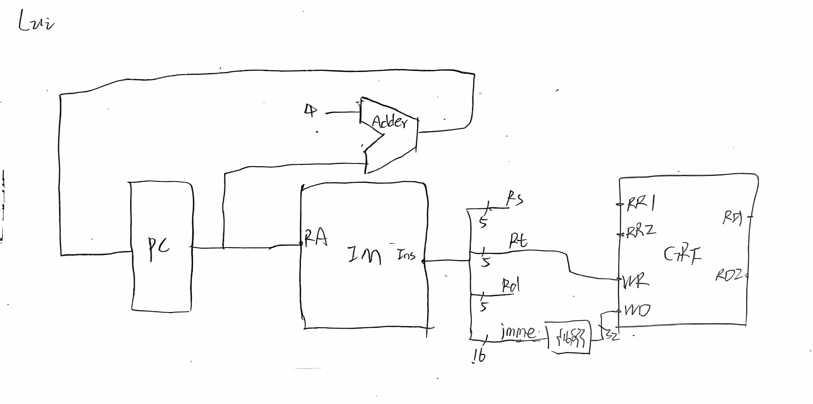

# CPU基本组成

### 一.数据通路
#### 1. ALU
    顾名思义，进行各种运算，包括加、减、与、或、大小比较等

#### 2. MUX
    logisim内置
    用于数据通路的合并
#### 3. EXT
    将32位指令中的16位immediate符号扩展或者零扩展为32位
    将16位immediate加载至高位，低位补0
#### 4. GRF
    参与读写操作
#### 5. DM
    存储数据，用RAM实现，容量为3072×32bit
    地址范围：0x00000000~0x00002FFF
#### 6. IM
    存储指令，用ROM实现，容量为4K×32bit
    地址范围：0x00003000~0x00006FFF
#### 7. PC
    传递指令地址，注意异步复位为0x00003000

#### 8. NPC
    计算NextPC
### 二.控制器
    传递各种控制信号让CPU实现不同功能，采用“与或门阵列”的方式进行设计，与门阵列处理指令类型，或门阵列
    确定各个控制信号的值。
#### 1.主控单元
    输入：指令操作码字段Op（指令[31:26]位）
    输出：
        7个控制信号（MUX 4个，DM 2个，Regs 1个）
        ALU控制单元所需的2位输入ALUop
#### 2.ALU控制单元
    输入：
        主控单元生成的ALUop（2位）
        功能码字段Func（指令[5:0]位）
    输出：ALU运算控制信号ALU operation（4位）

# 要实现的指令集
    基本实现思想：先分别设计出各个指令的数据通路，然后将数据通路合并
#### 1.addu

草图：

#### 2.subu

草图：

#### 3.ori

草图：

#### 4.lw

草图：

#### 5.sw

草图：

#### 6.beq

草图：

#### 7.lui

草图：

#### 8.nop
    由于该指令的特殊性，不需要进行处理

# 进行测试
    利用课程提供的testcode文件以及评论区大佬们提供的测试工具进行测试

# 思考题
#### 1.单周期CPU所用到的模块中，哪些发挥状态存储功能，哪些发挥状态转移功能？
    状态存储：GRF、DM
    状态转移：Controller、ALU、IFU、EXT
#### 2.现在我们的模块中IM使用ROM，DM使用RAM，GRF使用Register，这种做法合理吗？请给出分析，若有改进意见也请一并给出。
    合理，因为IM只需要进行读取而不需要写入，所以使用只读的ROM，而DM既需要进行读取也需要进行写入，所以使用可读可
    写的RAM，GRF既需要读也需要写，而且需要较快的读写速度，所以选用寄存器堆
#### 3.在上述提示的模块之外，你是否在实际实现时设计了其他的模块？如果是的话，请给出介绍和设计的思路。
    我还设计了用于实现PC自增的模块NPC，当当前指令不是beq时，NPC会将PC更新为PC+4，反之会将PC更新为
    PC+4+signed_entend(immediate||0^2);另外还有将32位指令分为opcode、func等的DST模块。
#### 4.事实上，实现`nop`空指令，我们并不需要将它加入控制信号真值表，为什么？
    nop指令相当于 sll $zero,$zero,0，因为他们的指令码都是0x00000000，将0寄存器中的值左移0位后再存入0寄存器，
    这不会发生任何变化，程序中的其它指令也不会受到任何影响，因此是否将nop指令加入到控制信号真值表中不会对电路设
    计产生影响，故而不需要将nop加入控制信号真值表中。
#### 5.阅读Pre的“MIPS指令集及汇编语言”一节中给出的测试样例，评价其强度（可从各个指令的覆盖情况，单一指令各种行为的覆盖情况等方面分析），并指出具体的不足之处。
    ori $a0, $0, 123
    ori $a1, $a0, 456
    lui $a2, 123            # 符号位为 0
    lui $a3, 0xffff         # 符号位为 1
    ori $a3, $a3, 0xffff    # $a3 = -1
    add $s0, $a0, $a2      # 正正
    add $s1, $a0, $a3      # 正负
    add $s2, $a3, $a3      # 负负
    ori $t0, $0, 0x0000
    sw $a0, 0($t0)
    sw $a1, 4($t0)
    sw $a2, 8($t0)
    sw $a3, 12($t0)
    sw $s0, 16($t0)
    sw $s1, 20($t0)
    sw $s2, 24($t0)
    lw $a0, 0($t0)
    lw $a1, 12($t0)
    sw $a0, 28($t0)
    sw $a1, 32($t0)
    ori $a0, $0, 1
    ori $a1, $0, 2
    ori $a2, $0, 1
    beq $a0, $a1, loop1     # 不相等
    beq $a0, $a2, loop2     # 相等
    loop1:sw $a0, 36($t0)
    loop2:sw $a1, 40($t0)

    sw指令没有测试向$zero寄存器中存储数据，不能正确检测GRF模块的正确性。