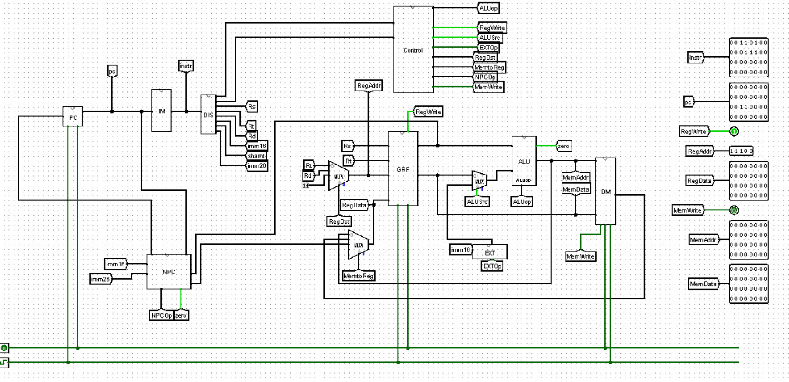
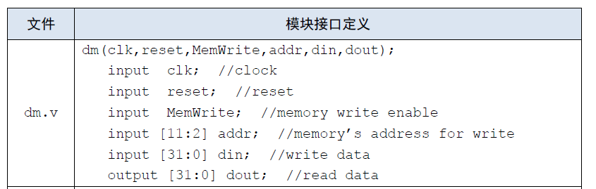

# CPU基本组成
## 顶层设计

要实现的指令：**add,sub,ori,lw,sw,lui,beq,jal,jr,nop**
相比于P3只将PC模块和IM模块合并，其他没有任何变化，照着电路图翻译便可
***
### 一.主要部件
    命名约定：模块均用大写字母命名，每个模块的输入输出信号均以大写字母开头（clk和reset除外），mips模块中的连线信号均用小写字母命名
#### 1. ALU
    顾名思义，进行各种运算，包括加、减、与、或、大小比较等
|     信号     | 方向  |                描述                |
| :----------: | :---: | :--------------------------------: |
|  RD1[31:0]   | 输入  |       来自于GRF的第一个输出        |
|  RD2[31:0]   | 输入  | 由ALUSrc选择来自GRF还是32位立即数  |
|  ALUOp[2:0]  | 输入  |      控制信号，选择ALU的功能       |
|     Zero     | 输出  | RD1==RD2时置1，用于NPC模块中的判断 |
| ALUOut[31:0] | 输出  |         ALU模块的计算结果          |
#### 2. MUX
    在verilog中用条件语句实现，如三目运算符
    用于数据通路的合并
```
assign aluin2 = (alusrc)?imme32:rd2;
```
#### 3. EXT
    将32位指令中的16位immediate符号扩展或者零扩展为32位
    将16位immediate加载至高位，低位补0
|     信号     | 方向  |               描述               |
| :----------: | :---: | :------------------------------: |
| Imme16[15:0] | 输入  |      需要被扩展的16位立即数      |
|    ExtOp     | 输入  | 控制信号，选择符号扩展还是零扩展 |
| Imme32[31:0] | 输出  |        扩展后的32位立即数        |

#### 4. GRF
    参与读写操作
|   信号    | 方向  |              描述               |
| :-------: | :---: | :-----------------------------: |
|    clk    | 输入  |            时钟信号             |
|   reset   | 输入  |          同步复位信号           |
| RegWrite  | 输入  | 控制信号，为真时GRF方可写入数据 |
| RA1[4:0]  | 输入  |             读地址              |
| RA2[4:0]  | 输入  |             读地址              |
|  WA[4:0]  | 输入  |             写地址              |
| WD[31:0]  | 输入  |          要写入的数据           |
| PC[31:0]  | 输入  |         当前指令的地址          |
| RD1[31:0] | 输出  |            读出的值             |
| RD2[31:0] | 输出  |            读出的值             |
#### 5. DM
    存储数据，用RAM实现，容量为3072×32bit，RAM在verilog中可以用reg型变量来实现
    地址范围：0x00000000~0x00002FFF
|   信号   | 方向  |              描述              |
| :------: | :---: | :----------------------------: |
|   clk    | 输入  |            时钟信号            |
|  reset   | 输入  |          同步复位信号          |
| MemWrite | 输入  | 控制信号，为真时DM方可写入数据 |
| WA[31:0] | 输入  |         写入数据的地址         |
| WD[31:0] | 输入  |          要写入的数据          |
| PC[31:0] | 输入  |         当前指令的地址         |
| RD[31:0] | 输出  |           读出的数据           |
#### 6. NPC
    计算NextPC
|     信号      | 方向  |             描述             |
| :-----------: | :---: | :--------------------------: |
|   Pc[31:0]    | 输入  |          当前的PC值          |
|  NpcOp[2:0]   | 输入  | 控制信号，决定下一个PC的取值 |
|  JrReg[31:0]  | 输入  |    指令为jr时，npc取JrReg    |
| Imme26[25:0]  | 输入  |     jal指令所需的立即数      |
| Imme16[15:0]  | 输入  |          16位立即数          |
|     Zero      | 输入  |     来自ALU，是选择信号      |
| PcPlus4[31:0] | 输出  |             PC+4             |
|   Npc[31:0]   | 输出  |         下一个PC的值         |
#### 7. IFU
    将原先logisim中的PC模块和IM模块合并为IFU模块，ROM在verilog中可以用reg型变量来实现
|    信号     | 方向  |                描述                |
| :---------: | :---: | :--------------------------------: |
|     clk     | 输入  |              时钟信号              |
|    reset    | 输入  | 同步复位信号，复位值是32'h00003000 |
|  Npc[31:0]  | 输入  |    来自NPC模块，是下一个PC的值     |
|  Pc[31:0]   | 输出  |             当前PC的值             |
| Instr[31:0] | 输出  |            当前的指令值            |
***
### 二.控制器(ctrl)
    传递各种控制信号让CPU实现不同功能，采用“与或门阵列”的方式进行设计，与门阵列处理指令类型，或门阵列
    确定各个控制信号的值。
有两种实现方式：**记录指令所对应的控制信号如何取值**、**记录控制信号每种取值所对应的指令**，这里采用第一种方式
|     信号      | 方向  |              描述              |
| :-----------: | :---: | :----------------------------: |
|  Opcode[5:0]  | 输入  |                                |
|   Func[5:0]   | 输入  |                                |
|  NPCOp[2:0]   | 输出  |   NPC模块中选择下一个PC的值    |
|  RegDst[1:0]  | 输出  |      选择GRF端口RA2的来源      |
| MemtoReg[1:0] | 输出  |      选择GRF端口WD的来源       |
|   RegWrite    | 输出  |     为真时GRF才能写入数据      |
|     ExtOp     | 输出  | 选择立即数是符号扩展还是零扩展 |
|    ALUSrc     | 输出  |  选择ALU第二个输入数据的来源   |
|  ALUOp[2:0]   | 输出  |       选择ALU实现的功能        |
|   MemWrite    | 输出  |      为真时DM才能写入数据      |


| 指令  | NPCOp[2:0] | RegDst[1:0] | MemtoReg[1:0] | RegWrite | ExtOp | ALUSrc | ALUOp[2:0] | MemWrite |
| :---: | :--------: | :---------: | :-----------: | :------: | :---: | :----: | :--------: | :------: |
|  add  |   3'b000   |    2'b01    |     2'b00     |    1     |   0   |   0    |   3'b000   |    0     |
|  sub  |   3'b000   |    2'b01    |     2'b00     |    1     |   0   |   0    |   3'b001   |    0     |
|  ori  |   3'b000   |    2'b00    |     2'b00     |    1     |   0   |   1    |   3'b011   |    0     |
|  lw   |   3'b000   |    2'b00    |     2'b01     |    1     |   1   |   1    |   3'b000   |    0     |
|  sw   |   3'b000   |    2'b00    |       ×       |    0     |   1   |   1    |   3'b000   |    1     |
|  beq  |   3'b001   |      ×      |       ×       |    0     |   1   |   1    |   3'b001   |    ×     |
|  lui  |   3'b000   |    2'b00    |     2'b00     |    1     |   0   |   1    |   3'b000   |    0     |
|  jal  |   3'b010   |    2'b10    |     2'b10     |    0     |   0   |   ×    |     ×      |    0     |
|  jr   |   3'b011   |      ×      |       ×       |    ×     |   ×   |   ×    |     ×      |    ×     |
|  nop  |   3'b000   |    2'b00    |       ×       |    ×     |   ×   |   ×    |     ×      |    ×     |
***
# 数据通路
logisim中连接各个模块的导线在verilog中由变量来完成，两个相连的端口之间用一个相同的变量即表示这两个端口通过这个变量相连。
在mips.v中，先定义一堆用于表示连线的变量，如：
```
	wire [31:0] pc, pcPlus4, instr, npc, rd1, rd2, aluout, imme32, aluin2, wd, DMaddr, dmout;
	wire [2:0] aluop, npcop;
	wire[1:0]  regdst, memtoreg;
	wire [5:0] opcode, func;
	wire [4:0] rs, rt, rd, shamt, addr;
	wire [15:0] imme16;
	wire[25:0] imme26;
	wire extop, zero, memwrite, regwrite, alusrc;
```
然后将ALU等模块实例化即可，如：
```
	ALU _alu (
    .RD1(rd1), 
    .RD2(aluin2), 
    .ALUOp(aluop), 
    .ALUout(aluout), 
    .Zero(zero)
    );
```
对于需要进行多路选择器选择的端口，可以在实例化这个模块之前利用三目运算符解决，如：
```
assign aluin2 = (alusrc == 0) ? rd2 : imme32;
```
***
# 进行测试
    测试代码：
```
lui     $t6, 0x0000
lui     $t7, 0x0000
ori     $at, $zero, 0x3456
add     $v0, $at, $t1
lw      $at, 4($zero)
sw      $at, 4($zero)
lui     $v0, 0x7878
sub     $v1, $v0, $at
lui     $a1, 0x1234
ori     $a0, $zero, 5
nop
sw      $t0, -1($a0)
lw      $v1, -1($a0)
beq     $v1, $a1, label1
nop
beq     $zero, $zero, label2
nop
ori     $t7, $v1, 0x0404
beq     $a3, $v1, label3
nop
lui     $t0, 0x7777
ori     $t0, $t0, 0xFFFF
sub     $t0, $zero, $t0
ori     $t0, $zero, 0x1100
add     $t2, $a3, $t6
ori     $t0, $zero, 0x0000
ori     $t1, $zero, 0x0001
ori     $t2, $zero, 0x0001
add     $t0, $t0, $t2
beq     $t0, $t1, label4
jal     function
nop
add     $t0, $t2, $t5
beq     $zero, $zero, end
add     $t0, $t2, $t5
jr      $ra
nop

```

# 思考题
#### 1.阅读下面给出的 DM 的输入示例中（示例 DM 容量为 4KB，即 32bit × 1024字），根据你的理解回答，这个 addr 信号又是从哪里来的？地址信号 addr 位数为什么是 [11:2] 而不是 [9:0] ？


    addr信号是指DM的写入地址，因此来自于ALU模块的输出。
    ALU计算得到的地址是字节地址，而DM中的数据索引是字地址，1字=4字节，故应该将字节地址除以四得到字地址，也就是应该用[11:2]。

#### 2.思考上述两种控制器设计的译码方式，给出代码示例，并尝试对比各方式的优劣。
第一种：
```
if(add) begin
    NPCOp = 3'b000;
    RegDst = 2'b00;
    MemtoReg = 2'b00;
    RegWrite = 0;
    ExtOp = 0;
    ALUSrc = 0;
    ALUOp = 3'b000;
    MemWrite = 0;
end
```
第二种：
```
    assign NPCOp = (jr)? 3'b011:
    			   (jal) ? 3'b010:
    			   (beq)? 3'b001:
    			   3'b000;
```
    相比而言，第一种方法更加明了，再添加指令时便于操作，但是代码会更加冗长，而第二种方式更加简短，但是在添加指令时没有第一种那么粗暴简单。

#### 3.在相应的部件中，复位信号的设计都是同步复位，这与 P3 中的设计要求不同。请对比同步复位与异步复位这两种方式的 reset 信号与 clk 信号优先级的关系。
    在同步复位中，只有当时钟上升沿到来时，reset为真才能实现复位，因此clk信号比reset信号优先级要高。
    而在异步复位中，不论是不时钟上升沿，只要reset为真，就能实现复位，因此reset信号比clk优先级要高。
#### 4.C 语言是一种弱类型程序设计语言。C 语言中不对计算结果溢出进行处理，这意味着 C 语言要求程序员必须很清楚计算结果是否会导致溢出。因此，如果仅仅支持 C 语言，MIPS 指令的所有计算指令均可以忽略溢出。 请说明为什么在忽略溢出的前提下，addi 与 addiu 是等价的，add 与 addu 是等价的。提示：阅读《MIPS32® Architecture For Programmers Volume II: The MIPS32® Instruction Set》中相关指令的 Operation 部分。
    addu和addiu相较于add和addi多了溢出检查，当发生溢出时，addu和addiu会抛出异常，而add和addi则不会报
    错，当忽略溢出时，add,addu,addi,addiu都不会报错，因此在忽略溢出时,add和addu是等价的，addi和addiu是等价的