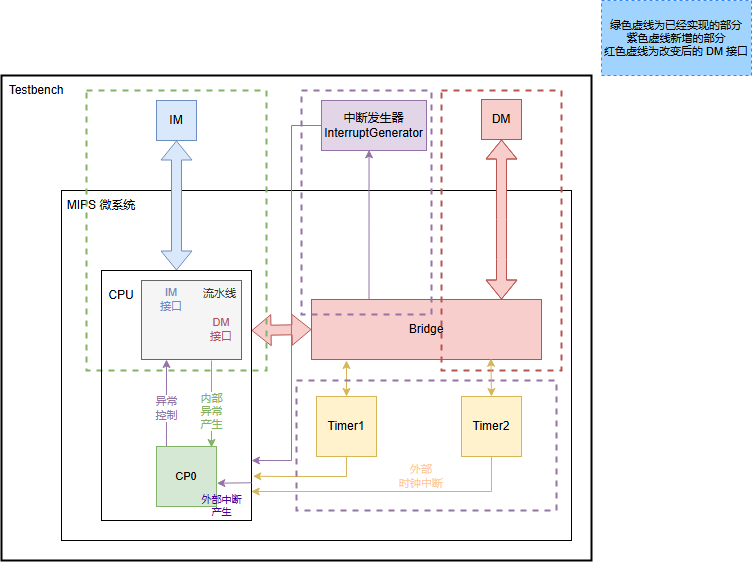
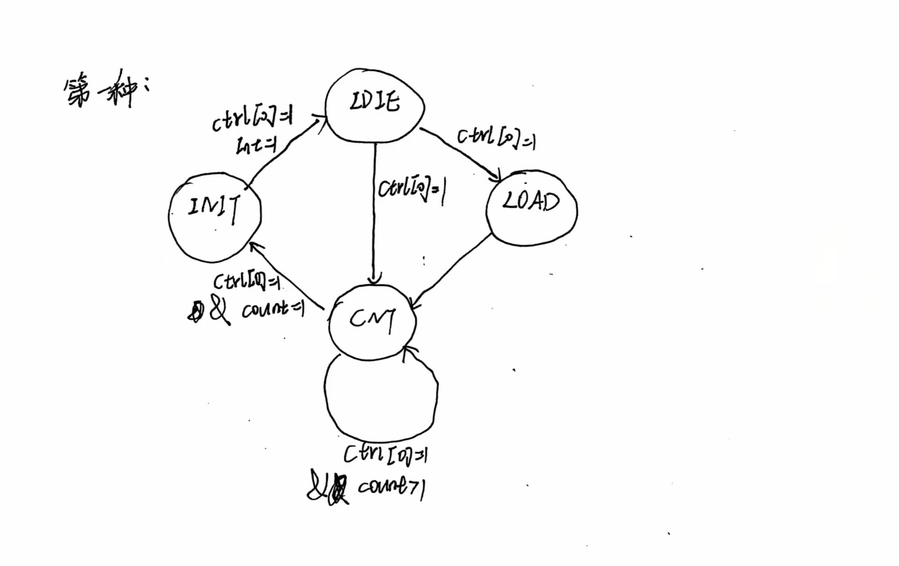
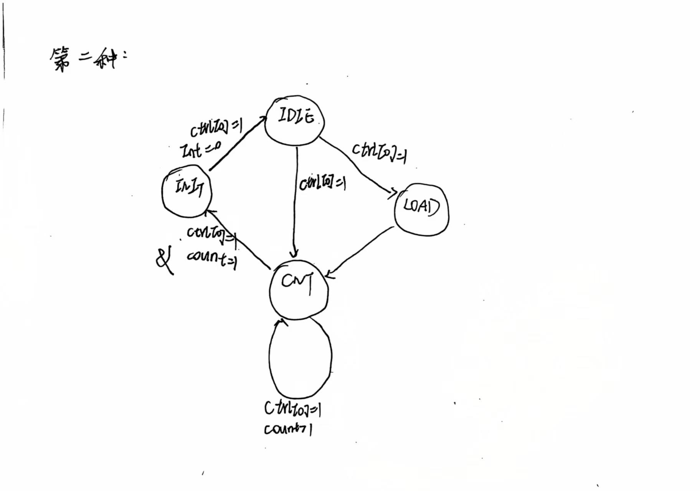

## 顶层设计

.jpg>)
**R型指令：**
| 31:26  | 25:21 | 20:16 | 15:11 | 10:6  |  5:0  |
| :----: | :---: | :---: | :---: | :---: | :---: |
| opcode |  rs   |  rt   |  rd   | shamt | func  |

**I型指令：**
| 31:26  |  25:21   | 20:16 |      15:0      |
| :----: | :------: | :---: | :------------: |
| opcode | rs(base) |  rt   | imme16(offset) |

**J型指令：**
| 31:26  |        25:0         |
| :----: | :-----------------: |
| opcode | imme26(instr_index) |

要实现的指令集：

|    指令类型    | 信号名  | 数量  |           指令           |
| :------------: | :-----: | :---: | :----------------------: |
| 算术逻辑寄存器 |  cal_r  |   6   | add,sub,and,ori,slt,sltu |
| 算术逻辑立即数 |  cal_i  |   3   |    addi,andi,ori,lui     |
|     读内存     |  lord   |   3   |         lb,lh,lw         |
|     写内存     |  store  |   3   |         sb,sh,sw         |
|  两数比较分支  | branch  |   2   |         beq,bne          |
|   仅写入跳转   | jump_l  |   1   |           jal            |
|   仅读取跳转   | jump_r  |   1   |            jr            |
|  乘除运算指令  |   md    |   4   |   mult,multu,div,divu    |
|   存入乘除槽   |   mt    |   2   |        mthi,mtlo         |
|   乘除槽取出   |   mf    |   2   |        mfhi,mflo         |
|   异常与中断   | exc_int |   4   |  syscall,mfc0,mtc0,eret  |

P7要实现的任务：
1. 更改流水线使之能够产生异常信号
2. 在流水线中添加CP0模块用于处理异常信号
3. 增加系统桥(Bridge)使CPU能够与外设(两个计时器)进行交互

按照1-2-3的顺序进行开发
***
## 命名规范：
1. 每个模块均使用大写字母命名，命名方式为模块所在层级+英文简称，比如E_ALU表示处在E级的ALU模块
2. 每个非流水线寄存器模块的端口信号均以大写字母开头，辅以小写字母，命名方式为英文简称（clk、reset和enable除外）,对于流水线寄存器中需要进行流水的信号，输入信号用前一个阶段+信号简称命名，输入信号用后一个阶段+信号简称命名，比如F_PC、D_PC
3. 在mips.v中所有实例化模块均以模块命名的小写字母形式命名，比如e_alu,所有连线信号均以小写字母命名，命名方式为英文简称，英文简称有冲突时辅以英文说明
4. 四个流水线寄存器使用前后层级+REG命名，比如D_E_REG
***
## 主要部件

### F级
当发生异常时要进入异常处理程序，PC应该置32'h0000_4180，因此将req接入PC模块
#### F_PC
|   信号    | 方向  |       描述       |
| :-------: | :---: | :--------------: |
|    clk    | 输入  |     时钟信号     |
|   reset   | 输入  |   同步复位信号   |
|    req    | 输入  |     异常信号     |
|   stall   | 输入  |     阻塞信号     |
|  enable   | 输入  |    写使能信号    |
| NPC[31:0] | 输入  | 下一条指令的地址 |
| PC[31:0]  | 输出  |  当前指令的地址  |
### D级
当发生异常时NPC要指向异常处理程序的入口，也就是32'h0000_4180，而当异常结束也就是遇到eret指令时要跳转回EPC，NPC应该置EPC+4，因此将req、EPC和eret接入NPC模块
#### F_D_REG
|      信号      | 方向  |         描述         |
| :------------: | :---: | :------------------: |
|   F_PC[31:0]   | 输入  |     来自F级的PC      |
| F_Instr[31:0]  | 输入  |    来自F级的Instr    |
| F_EXCCode[4:0] | 输入  |   来自F级的异常码    |
|  F_DelaySlot   | 输入  |  来自F级的DelaySlot  |
|      clk       | 输入  |       时钟信号       |
|     reset      | 输入  |     同步复位信号     |
|     enable     | 输入  |       使能信号       |
|      req       | 输入  |       异常信号       |
|     stall      | 输入  |       阻塞信号       |
|   D_PC[31:0]   | 输出  |    流水到D级的PC     |
| D_Instr[31:0]  | 输出  |   流水到D级的Instr   |
|  D_DelaySlot   | 输出  | 流水到D级的DelaySlot |
| D_EXCCode[4:0] | 输出  |  流水到D级的异常码   |
#### D_CMP
    与P6相比无变化
|    信号     | 方向  |           描述           |
| :---------: | :---: | :----------------------: |
| Rtout[31:0] | 输入  |    参与比较的第一个数    |
| Rsout[31:0] | 输入  |    参与比较的第二个数    |
| CMPop[1:0]  | 输入  |       比较控制信号       |
|   Jump_b    | 输出  | branch类指令是否跳转信号 |
#### D_EXT
    与P6相比无变化
|     信号     | 方向  |         描述         |
| :----------: | :---: | :------------------: |
| Imme16[15:0] | 输入  |  待扩展的16位立即数  |
|  EXTop[1:0]  | 输入  |   扩展方式控制信号   |
| Imme32[31:0] | 输出  | 扩展之后的32位立即数 |
#### D_GRF
    与P6相比无变化
|   信号    | 方向  |              描述               |
| :-------: | :---: | :-----------------------------: |
|    clk    | 输入  |            时钟信号             |
|   reset   | 输入  |          同步复位信号           |
| RegWrite  | 输入  | 控制信号，为真时GRF方可写入数据 |
| RA1[4:0]  | 输入  |             读地址              |
| RA2[4:0]  | 输入  |             读地址              |
|  WA[4:0]  | 输入  |             写地址              |
| WD[31:0]  | 输入  |          要写入的数据           |
| PC[31:0]  | 输入  |         当前指令的地址          |
| RD1[31:0] | 输出  |            读出的值             |
| RD2[31:0] | 输出  |            读出的值             |
#### D_NPC
    当发生异常时，CP0会产生异常信号req，此时程序要跳转到异常处理入口，也就是0x0000_4180，因此
    req为真时Npc置0x0000_4180;当异常处理结束，也就是遇到eret指令时，程序要跳转回发生异常的那
    个指令，也就是EPC，因此Npc置EPC+4
|       信号        | 方向  |           描述           |
| :---------------: | :---: | :----------------------: |
|   Offset[15:0]    | 输入  |        16位立即数        |
| Instr_index[25:0] | 输入  |    jal指令相关立即数     |
|    NPCop[2:0]     | 输入  |     跳转方式选择信号     |
|    JrReg[31:0]    | 输入  |     jr指令目的寄存器     |
|    F_PC[31:0]     | 输入  |         F级PC值          |
|    D_PC[31:0]     | 输入  |         D级PC值          |
|       Zero        | 输入  | 判断branch类指令是否跳转 |
|        req        | 输入  |         异常信号         |
|       eret        | 输入  |        跳转到EPC         |
|     EPC[31:0]     | 输入  |   发生异常时记录的PC值   |
|     Npc[31:0]     | 输出  |     下一条指令的地址     |
### E级
当发生异常时不能进行乘除法，因此将req接入MDU模块
由ALU模块来计算溢出异常，包括运算指令溢出和存取指令溢出，运算指令溢出在E级就可以转换为异常码，但是存取指令溢出要流水到M级才能转换为异常码。
#### E_ALU
    增加对算术溢出和存取地址计算溢出的判断
|       信号       | 方向  |             描述             |
| :--------------: | :---: | :--------------------------: |
|     A[31:0]      | 输入  |         第一个运算数         |
|     B[31:0]      | 输入  |         第二个运算数         |
|  ALUCalOverflow  | 输入  |       计算溢出控制信号       |
| ALUStoreOverflow | 输入  |        存地址溢出信号        |
| ALULoadOverflow  | 输入  |        取地址溢出信号        |
|    ALUop[2:0]    | 输入  |        ALU的控制信号         |
|   ALUout[31:0]   | 输出  |        ALU的计算结果         |
|   CalOverflow    | 输出  |    为真则说明计算指令溢出    |
|  StoreOverflow   | 输出  | 为真则说明存指令地址计算溢出 |
|   LoadOverflow   | 输出  | 为真则说明取指令地址计算溢出 |
#### E_MDU
    新增异常信号req，req为真时停止乘除运算
|     信号      | 方向  |                 描述                  |
| :-----------: | :---: | :-----------------------------------: |
|      clk      | 输入  |               时钟信号                |
|     reset     | 输入  |             同步复位信号              |
|     Start     | 输入  |          开始乘除指令的信号           |
|      req      | 输入  |               异常信号                |
|  MDUop[2:0]   | 输入  |           乘除指令控制信号            |
| Rs_data[31:0] | 输入  |          参与运算的第一个数           |
| Rt_data[31:0] | 输入  |          参与运算的第二个数           |
|     Busy      | 输出  | 当前是否在进行乘除指令，为1则正在进行 |
|      HI       | 输出  |   储存乘运算的高32位和除运算的余数    |
|      LO       | 输出  |    储存乘运算的低32位和除运算的商     |
### M级
    在M级新增针对Load和Store指令异常判断的LSEXC模块和处理异常中断的CP0模块
#### M_BE
    新增使能信号，使能信号为!req，当使能信号为假时byteen输出为4'b0000
|     信号      | 方向  |                 描述                 |
| :-----------: | :---: | :----------------------------------: |
|  Addr[31:0]   | 输入  |            写入内存的地址            |
|   BEop[2:0]   | 输入  |          存储指令的控制信号          |
|    enable     | 输入  |               使能信号               |
| Rt_data[31:0] | 输入  |             待修改的数据             |
|  Byteen[3:0]  | 输出  |             字节使能信号             |
|   WD[31:0]    | 输出  | 经过存储指令处理后的要写入内存的数据 |
#### M_DE
    同P6
|    信号    | 方向  |        描述        |
| :--------: | :---: | :----------------: |
|  A[31:0]   | 输入  |   写入内存的地址   |
| Din[31:0]  | 输入  | 带要进行扩展的数据 |
| DEop[2:0]  | 输入  |  数据扩展控制信号  |
| Dout[31:0] | 输出  |   扩展之后的数据   |
#### M_LSEXC
    P7新增模块，用于判断存取指令的异常(不包括地址计算溢出)
|     信号      | 方向  |                    描述                    |
| :-----------: | :---: | :----------------------------------------: |
| Address[31:0] | 输入  |                  DM的地址                  |
|   DEop[2:0]   | 输入  |              DE模块的控制信号              |
|   BEop[2:0]   | 输入  |              BE模块的控制信号              |
|     Load      | 输入  |        判断当前指令是否是Load类指令        |
|     Store     | 输入  |       判断当前指令是否是Store类指令        |
| StoreOverflow | 输入  | 由ALU模块产生的Store类指令地址计算溢出信号 |
| LoadOverflow  | 输入  | 由ALU模块产生的Load类指令地址计算溢出信号  |
| excAdEL_load  | 输出  |         有关Load类指令的AdEL型异常         |
| excAdES_store | 输出  |        有关Store类指令的AdES型异常         |
#### M_CP0
    P7新增模块，用于接收异常和中断信号，产生req信号和EPC
|      信号       | 方向  |             描述             |
| :-------------: | :---: | :--------------------------: |
|       clk       | 输入  |           时钟信号           |
|      reset      | 输入  |         同步复位信号         |
|     enable      | 输入  |           使能信号           |
| CP0Address[4:0] | 输入  |   mfc0要写的寄存器地址(rd)   |
|   CP0In[31:0]   | 输入  |  mtc0要写入CP0寄存器的数据   |
|  CP0Out[31:0]   | 输出  |    mfc0要写入寄存器的数据    |
|    VPC[31:0]    | 输入  |            受害PC            |
|      BDIn       | 输入  | 判断当前指令是否是延迟槽指令 |
| ExcCodeIn[4:0]  | 输入  |         输入的异常码         |
|   HWInt[5:0]    | 输入  |         接收中断信号         |
|     EXLClr      | 输入  |         EXL清空信号          |
|  EPCOut[31:0]   | 输出  |           输出EPC            |
|       Req       | 输出  |           输出Req            |
### W级
***
## 控制器设计
    与P6相比，控制器新增了与异常和中断有关的信号。
|       信号        | 方向  |                       描述                        |
| :---------------: | :---: | :-----------------------------------------------: |
|    Instr[31:0]    | 输入  |                输入的32位指令信号                 |
|      jump_b       | 输入  |                     跳转信号                      |
|      Rs[4:0]      | 输出  |                                                   |
|      Rt[4:0]      | 输出  |                                                   |
|      Rd[4:0]      | 输出  |              add,sub指令的目的寄存器              |
|    Shamt[4:0]     | 输出  |                                                   |
|   Offset[15:0]    | 输出  |                                                   |
| Instr_index[25:0] | 输出  |                                                   |
|    ALUop[3:0]     | 输出  |                   ALU的控制信号                   |
|    EXTop[1:0]     | 输出  |     EXT的控制信号，1时符号扩展，反之进行0扩展     |
|     RegWrite      | 输出  | GRF写使能信号，为1时方可写寄存器，具体实现时恒为1 |
|    NPCop[2:0]     | 输出  |                    NPC控制信号                    |
|    CMPop[1:0]     | 输出  |                    CMP控制信号                    |
|    ALUSrc[2:0]    | 输出  |              选择ALU第二个数据的来源              |
|     BEop[2:0]     | 输出  |                  BE模块控制信号                   |
|     DEop[2:0]     | 输出  |                  DE模块控制信号                   |
|    MDUop[3:0]     | 输出  |                  MDU模块控制信号                  |
|       Start       | 输出  |      乘除模块启动信号，为1时开始进行乘除运算      |
|    FwSel[2:0]     | 输出  |                   选择转发数据                    |
| RegWriteDst[4:0]  | 输出  |              每个指令写寄存器的地址               |
|   Tuse_rs[1:0]    | 输出  |              每个指令rs寄存器的Tuse               |
|   Tuse_rt[1:0]    | 输出  |              每个指令rt寄存器的Tuse               |
|    Tnew_E[1:0]    | 输出  |                每个指令在E级的Tuse                |
|    Tnew_M[1:0]    | 输出  |                每个指令在M级的Tuse                |
|        RI         | 输出  |                      RI异常                       |
|      Syscall      | 输出  |                    Syscall异常                    |
|       Eret        | 输出  |              判断当前指令是否是eret               |
|       Mtc0        | 输出  |              判断当前指令是否是mtc0               |
|  ALUCalOverflow   | 输出  |              计算指令溢出的控制信号               |
| ALUStoreOverflow  | 输出  |         Store类指令地址计算溢出的控制信号         |
|  ALULoadOverflow  | 输出  |         Load类指令地址计算溢出的控制信号          |
***
## 冲突解决
    与P6相比，新增eret指令的阻塞和mtc0指令的转发
在阻塞上，增加如下：
```
    wire stall_M_eret = D_eret && ((E_mtc0 && E_RegReadDst_rd == 5'd14) || (M_mtc0 && M_RegReadDst_rd == 5'd14));
```
在转发上，新增对mfc0的转发，如下：
```
    assign w_grfwd = (w_fwsel == `FwSel_aluout)?w_aluout:
                     (w_fwsel == `FwSel_pc8)?w_pc + 32'd8:
                     (w_fwsel == `FwSel_mduout)?w_mduout:
                     (w_fwsel == `FwSel_dmout)?w_dmout:
                     (w_fwsel == `FwSel_CP0out)?W_CP0out:
                     32'bz;
```
其余同P6：

    利用AT法解决
    Tuse是指某一指令在D级再经过多少个时钟周期就必须要使用相应的数据，Tnew是指位于某个流水级的某个指令，它经过多少个时钟周期可以算出结果并且存储到流水线寄存器里。
|  指令  | A信号 | $Tnew-E$ | $Tnew-M$ | $Tuse-rs$ | $Tuse-rt$ |
| :----: | :---: | :------: | :------: | :-------: | :-------: |
| cal_r  |  rd   |    1     |    0     |     1     |     1     |
| cal_i  |  rt   |    1     |    0     |     1     |   null    |
|  lord  |  rt   |    2     |    1     |     1     |   null    |
| store  |   0   |    0     |    0     |     1     |     2     |
| branch |   0   |    0     |    0     |     0     |     0     |
| jump_l |  31   |    0     |    0     |   null    |   null    |
| jump_r |   0   |    0     |    0     |     0     |   null    |
|   md   |   0   |    0     |    0     |     1     |     1     |
|   mf   |  rd   |    1     |    0     |   null    |   null    |
|   mt   |   0   |    0     |    0     |     1     |   null    |

    A信号是该指令的目的寄存器，如没有则取0;null表示该指令不使用该寄存器，在具体实现时信号用可取的
    最大值表示。

#### 阻塞设计
    设计专门的stall模块来处理合适要进行阻塞，stall模块会输出stall信号
首先要明确阻塞发生的条件：当冲突发生时，较旧的指令无法及时提供给较新的指令其所计算出来的值，便需要插入一个nop空泡，也就是使用阻塞，具体条件是**旧指令寄存器的写入地址和新指令寄存器的读出地址相同且读出地址不为0，而且旧指令的$Tnew$ $>$ 新指令的$Tuse$**。

课程要求**阻塞发生在D级**，因此当进行阻塞时，要将PC冻结，将F_D_REG的值冻结，将D_E_REG的值清零，也就是说我们要为IFU模块增加使能信号，为F_D_REG增加使能信号，为D_E_REG增加复位信号（异步复位），但是为了模块的统一性，我们为所有流水线寄存器都设置使能端`enable`和复位端`reset`,对于非上述两个流水线寄存器，使能信号恒为1，复位信号恒为0。

当进行乘除运算时，要求乘法进行5个时钟周期，除法进行10个时钟周期，但是实际上MDU的结果在一个周期内就可以得到，因此需要对乘除指令进行额外的阻塞判断。当Busy或者Start为1时，说明当前正在进行乘除运算，因此我们需要进行阻塞，此时如果在D级出现了和乘除槽有关的指令我们都需要进行阻塞，具体实现如下：
```
    wire stall;
    wire stall_mdu;
    wire STALL = stall | (stall_mdu && (D_mt | D_mf | D_md));
```
其中stall_mdu是MDU模块的输出，表明此时Busy和Start中有一个为1，而D_mt、D_mf、D_md说明D级是和乘除槽有关的指令。

#### 转发设计
和阻塞一样，首先要明确转发发生的条件。当一个较新的指令要使用的寄存器里的值还没有被较旧的指令写入到寄存器里面，但是已经被较旧的指令给算出来，这时候较新的指令便可以直接使用较旧的指令计算出来的值而不是使用寄存器里的值，这就是转发。

**如何实现转发？**

正如上文所说，所谓转发，就是新指令直接使用旧指令的结果，因此只需要比较新旧指令的目的寄存器的地址是否相同便可，相同而且$Tuse>=Tnew$便可以转发，否则便阻塞。
对于P6的指令集，写入寄存器的来源有四个：jal的PC+8，ALU的输出结果，DM的输出结果、MDU的输出结果。而对于E级的转发只能是PC+8，因为这时候ALUout和DMout还没有产生，M级的转发有PC+8、ALUout和MDUout，W级的转发有PC+8、ALUout、DMout和MDUout,我们可以在控制器中增加转发结果的选择信号，依照指令来选择转发结果，比如add就选择ALUout，lw就选择DMout，具体数据通路如下：

    需求者：D级GRF的两个输出端口，E级ALU的两个输入端口，M级DM的输入端口。
    供给者：E级的PC+8，M级的PC+8、ALUout和MDUout,W级的PC+8、ALUout、DMout和MDUout
    转发数据流：E_RFwd -> D_RD1
               E_RFwd -> D_RD2
               M_RFwd -> D_RD1
               M_RFwd -> D_RD2
               W_RFwd -> D_RD1      //GRF内部转发
               W_RFwd -> D_RD2      //GRF内部转发
               M_RFwd -> E_ALUinA
               M_RFwd -> E_ALUinB
               W_RFwd -> E_ALUinA
               W_RFwd -> E_ALUinB
               W_RFwd -> M_DMin

***
## 内部异常
要处理的异常如下表：
| 异常与中断码 |           名称            |   指令与指令类型   |                       描述                       | 完成情况 |
| :----------: | :-----------------------: | :----------------: | :----------------------------------------------: | :------: |
|      0       |   `Int` <br> (外部中断)   |      所有指令      |         中断请求，来源于计时器与外部中断         |    √     |
|      4       |  `AdEL` <br> (取指异常)   |      所有指令      |                  PC地址未字对齐                  |    √     |
|      4       |  `AdEL` <br> (取指异常)   |      所有指令      |            PC地址超过`0x3000~0x6ffc`             |    √     |
|      4       |  `AdEL` <br> (取数异常)   |        `lw`        |              取数地址未与4字节对齐               |    √     |
|      4       |  `AdEL` <br> (取数异常)   |        `lh`        |              取数地址未与2字节对齐               |    √     |
|      4       |  `AdEL` <br> (取数异常)   |     `lh`,`lb`      |                取Timer寄存器的值                 |    √     |
|      4       |  `AdEL` <br> (取数异常)   |     lord型指令     |                计算地址时加法溢出                |    √     |
|      4       |  `AdEL` <br> (取数异常)   |     lord型指令     | 取数地址超出DM、Timer0、Timer1、中断发生器的范围 |    √     |
|      5       |  `AdES` <br> (存数异常)   |        `sw`        |              存数地址未与4字节对齐               |    √     |
|      5       |  `AdES` <br> (存数异常)   |        `sh`        |              存数地址未与2字节对齐               |    √     |
|      5       |  `AdES` <br> (存数异常)   |     `sh`,`sb`      |                存Timer寄存器的值                 |    √     |
|      5       |  `AdES` <br> (存数异常)   |    store型指令     |                 计算地址加法溢出                 |    √     |
|      5       |  `AdES` <br> (存数异常)   |    store型指令     |            向计时器的Count寄存器存值             |    √     |
|      5       |  `AdES` <br> (存数异常)   |    store型指令     | 存数地址超出DM、Timer0、Timer1、中断发生器的范围 |    √     |
|      8       | `Syscall` <br> (系统调用) |     `syscall`      |                     系统调用                     |    √     |
|      10      |   `RI` <br> (未知指令)    |         -          |                   未知的指令码                   |    √     |
|      12      |   `0v` <br> (溢出异常)    | `add`,`addi`,`sub` |                     算术溢出                     |    √     |

虽然需要实现各种异常，但是需要传递到CP0模块的信号仅仅是异常码。
我们可以在流水线中的F_PC、D_control、E_ALU以及M级的数据存储器添加端口进行异常判断和传递异常信号,最终各级产生的异常信号流水到M级的CP0模块。
* 在F_PC实现：`AdEL`(取指异常) 
* 在D_control实现：`RI`(未知指令)、`syscall`(系统调用)
* 在E_ALU实现：`0v`(溢出异常)、`AdEL`和`AdES`的溢出异常
* 在M_DM实现：`AdEL`(取数异常)、`AdES`(存数异常)(二者均不包括溢出异常)

需要注意的是0号异常`Int`，其含义是没有发生任何异常，也就是当传递到CP0模块的异常是`Int`时，CP0只需要考虑外部中断即可。
*** 
## 外部中断
    当发生中断时，应该先处理中断，再处理异常，中断信号为6位的HWInt,在Bridge模块中产生
```
	assign HWInt = {3'b000,interrupt,Timer1_IRQ,Timer0_IRQ};
```
***
## 处理中断异常
如上面所言，应在流水线中新增CP0模块接收异常和中断信号，判断是否对其进行处理，在此，我选择将CP0模块添加在M级
产生req信号的部分：
```
	assign ExcReq = (!`EXL && (|ExcCodeIn) );
	assign IntReq = (!`EXL && `IE && (|(`IM & HWInt)) );
	assign Req = (ExcReq | IntReq);
```
对于延迟槽指令的处理：
```
	wire [31:0] temp_EPC = (Req) ? ( (BDIn) ? VPC - 4 : VPC) : EPC;
    assign EPCOut = temp_EPC;
```
对于mtc0指令的处理：
```
	always@(posedge clk) begin
		if(reset) begin
			SR <= 32'h0;
			Cause <= 32'h0;
			EPC <= 32'h0;
		end
		else begin
			if(EXLclr) `EXL <= 0;
			if(Req) begin
				`ExcCode <= (IntReq) ? 5'b0: ExcCodeIn;
				`EXL <= 1'b1;
				 EPC <= temp_EPC;
				`BD <= BDIn;
			end
			else if (WE) begin
				if(CP0Add == 12) SR <= CP0In;
				if(CP0Add == 14) EPC <= CP0In;      //教程已经给出不会写Cause寄存器
			end
			`IP <= HWInt;
		end
	end
```
对于mfc0指令的处理：
```
	assign CP0Out = (CP0Add == 12) ? SR:
	                (CP0Add == 13) ? Cause:
					(CP0Add == 14) ? EPC:
					32'h0; 
```
***
## 思考题
##### 1.请查阅相关资料，说明鼠标和键盘的输入信号是如何被 CPU 知晓的？
    信号生成：键盘按键生成扫描码，鼠标记录移动和按键状态，转换为数字信号。
    传输信号：通过接口（如 USB、PS/2 或蓝牙）将信号发送到计算机。
    硬件控制器处理：信号被控制器（如键盘/USB 控制器）解析成特定格式。
    中断通知 CPU：控制器通过中断请求 (IRQ) 通知 CPU 有新输入。
    操作系统处理：驱动程序解析信号，将其转化为按键或鼠标事件。
    应用响应：操作系统将事件传递给应用程序，完成输入响应。
##### 2.请思考为什么我们的 CPU 处理中断异常必须是已经指定好的地址？如果你的 CPU 支持用户自定义入口地址，即处理中断异常的程序由用户提供，其还能提供我们所希望的功能吗？如果可以，请说明这样可能会出现什么问题？否则举例说明。（假设用户提供的中断处理程序合法）
    因为处理异常程序的地址由外部硬件决定，如果要修改这个地址，则需要更改外设。
    我的CPU并不支持自定义入口地址，但是如果处理中断异常的程序由用户提供，其仍然能提供相应的功能，但是会造成整个CPU的复杂性大大提高。
##### 3.为何与外设通信需要Bridge?
    Bridge能够允许CPU用统一的方式来访问外设，比每增加一种外设就要增加一种访问方式相比，这种方式简单得多。
##### 4.请阅读官方提供的定时器源代码，阐述两种中断模式的异同，并分别针对每一种模式绘制状态移图。
    相同之处：都是在count=0时产生中断信号
    不同之处：第一种在计数结束后enable信号置0，停止计数，会持续产生中断信号，一直到enable被修改为1；而第二种在计数结束一个时钟周期后会再次进行计数，能够产生周期性的中断信号。


##### 5. 倘若中断信号流入的时候，在检测宏观 PC 的一级如果是一条空泡（你的 CPU 该级所有信息均为空）指令，此时会发生什么问题？在此例基础上请思考：在 P7 中，清空流水线产生的空泡指令应该保留原指令的哪些信息？
    这会导致32'd0写入EPC，异常处理完成后不能正确返回到程序。
    应该保留原指令的PC值和是否是延迟槽指令。
##### 6. 为什么 jalr 指令为什么不能写成 jalr $31, $31？
    对于jalr指令，其操作寄存器rs和rd不能相等，因为这样的指令在重新执行时没有相同的效果。执行这样一条指令的结果是不可预测的。这样的限制能够允许异常处理程序在分支延迟槽中发生异常时通过重新执行分支来恢复执行。